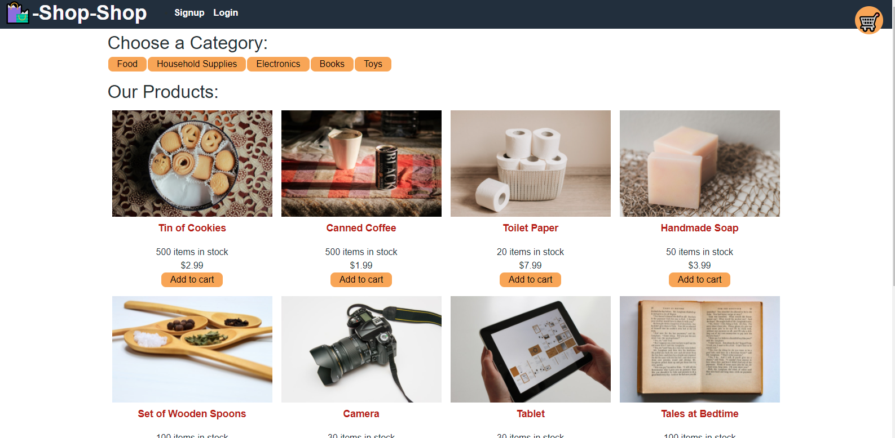

# redux-refactor
Refactored MERN stack application to use Redux

  ## Table of Contents
  
  - [Description](#description)
  - [Usage](#usage)
  - [Questions](#questions)

  ---

  ## Description

  This project is a MERN stack application which functions as an e-commerce site. My objective was to take a fully functioning app and refactor it to use Redux for global state management. 

  The app is deployed live here: https://redux-refactor-bc.herokuapp.com/
  ---

  ## Usage

  User have the ability to:  

  - See a list of products for sale 
  - Add products to their cart
  - Create an account to purchase those items

  
   

  ---

  ## Questions
  Have any questions? Feel free to check out my github or send me an Email!

  github.com/jacobmabob  
  thejacobmccarthy@gmail.com

